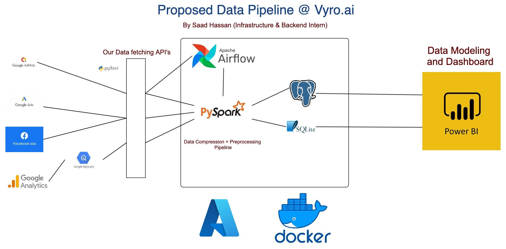

<div align="center">
<h1>Google Apps Revenue Data Pipeline</h1>
   <div align="center">
    
  </div>
   <h2>This project consists of a Data pipeline that collects data from Google Admob, Facebook Ads, Google Analytics, and Google Ads into CSV files.</h2>
</div>

## Installation steps

1. Clone the Repo and install the requirements

```
git clone https://github.com/saadhaxxan/Google-Apps-Revenue-DataPipeline.git
cd Google-Apps-Revenue-DataPipeline
pip install -r requirements.txt
```

2. Fill in the necessary credentials from Facebook and Google in the respective files and run
```
python cronjob.py
```
3. To run the Flask App do
```
python wsgi.py
```

## Author
You can get in touch with me on my LinkedIn Profile:

#### Saad Hassan
[](https://www.linkedin.com/in/saadhaxxan)

You can also follow my GitHub Profile to stay updated about my latest projects: [](https://github.com/saadhaxxan)

If you liked the repo then kindly support it by giving it a star ⭐!

## Contributions Welcome
[](#)

If you find any bug in the code or have any improvements in mind then feel free to generate a pull request.
